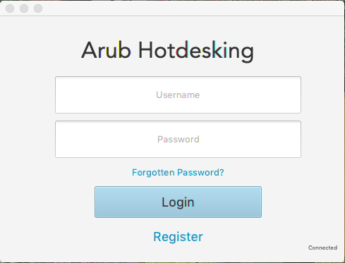
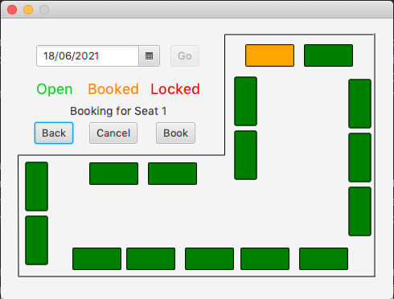
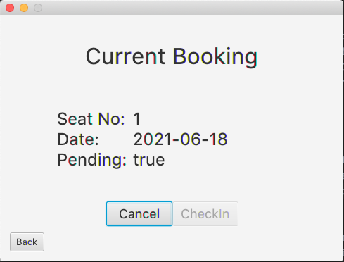
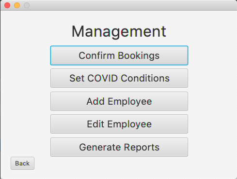
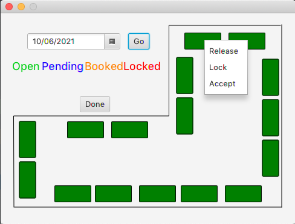

# Arub Hotdesking
> This application acts as a **complete** Hotdesking system for the Arub company. 
> It serves the main purpose of allocating seats to the employees of the company, allowing employees to prebook
> seating for particular days in the future.

## Meta
**Aiden Contini** – [s3780445](https://github.com/aiden21c) – s3780445@student.rmit.edu.au - Further Programming COSC2391

[https://github.com/FurtherProgramming/assignment-2-aiden21c.git](https://github.com/FurtherProgramming/assignment-2-aiden21c.git)



#Overview
This program serves the main purpose of allowing employees of a company to prebook office seating before attending work.
Arub wanted a solution to office seating which promotes social interaction in the workplace and this program solves this
by ensuring employees cannot book the same seat multiple days in a row. Due to the reality of the Covid-19 pandemic, system
admins are also given the ability to lockdown seats, deleting all incomplete bookings and preventing the booking of certain
seats indefinitely.

###Employees
Employees are only able to have one current booking at a time and this booking can not be for 
the same seat as their previous booking. Users can book a seat for any date more than 24 hours in the future. 
On the day of the booking, employees must check in to their booking for it to be recorded as completed. 
Within 48 hours prior to a booking commencing, a user is unable to alter or cancel their current booking.

|  | |
|---|---|
| <b>New Booking Page</b>| <b>Current Booking Page</b>|


###Admins
Admins are normal employees with administrative system permissions, allowing them to add/update/delete other users 
(as well as promote them to admin status). They can also manually change the whitelist of another user (the seats that 
user is allowed to book next), and generate CSV reports off all booking and user information from the database. 
Admins also have the responsibility to confirm (or reject) bookings, as any booking unconfirmed the day before commencement 
will be automatically cancelled. Admins can also set the Covid-19 conditions of the office, as well as lock down specific 
seats for specific dates in the future.

####Default Admin Login: 
`username: admin` `password: admin`

| |  |
|---|---|
| <b>Management Page</b>| <b>Confirm Bookings Page</b>|

## Installation

[comment]: <> (OS X & Linux:)

[comment]: <> (```sh)

[comment]: <> (npm install my-crazy-module --save)

[comment]: <> (```)

[comment]: <> (Windows:)

[comment]: <> (```sh)

[comment]: <> (edit autoexec.bat)

[comment]: <> (```)

## Development setup
The sqlite dependency must be present within a directory called `lib` under the root directory. This dependency is a `.jar` file and 
can be downloaded from [https://www.sqlite.org/](https://www.sqlite.org/download.html).

# Packaging
**The main class is Main.java**

###Class Packages:
- main.controller
- main.model
- main.ui

###Testing Package:
- test.model

#Testing
This program was thoroughly tested manually, and the DAO classes were unit tested using JUnit5.
No known bugs are present within the application, and no part of the program is known to be incomplete.
The specifications stated "It’s not important if other are booking in the way that can sit beside each other again",
and hence this functionality was not implemented within the application.